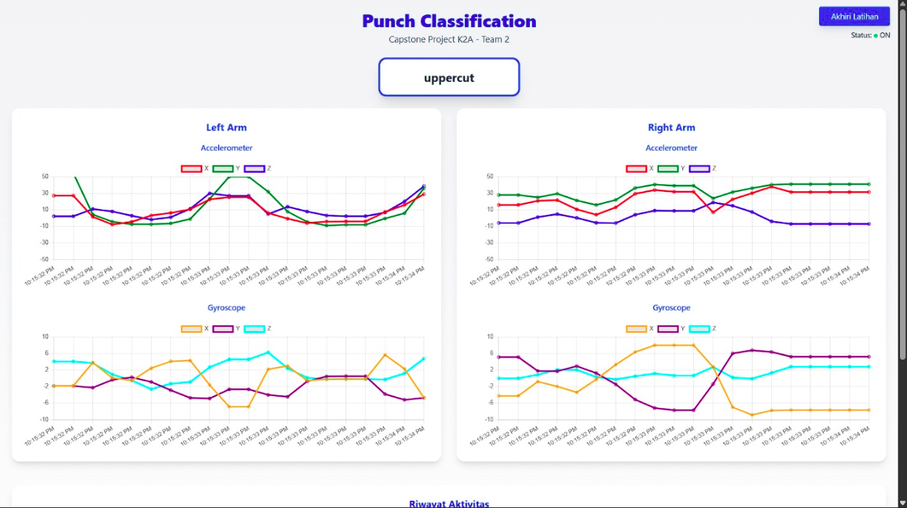
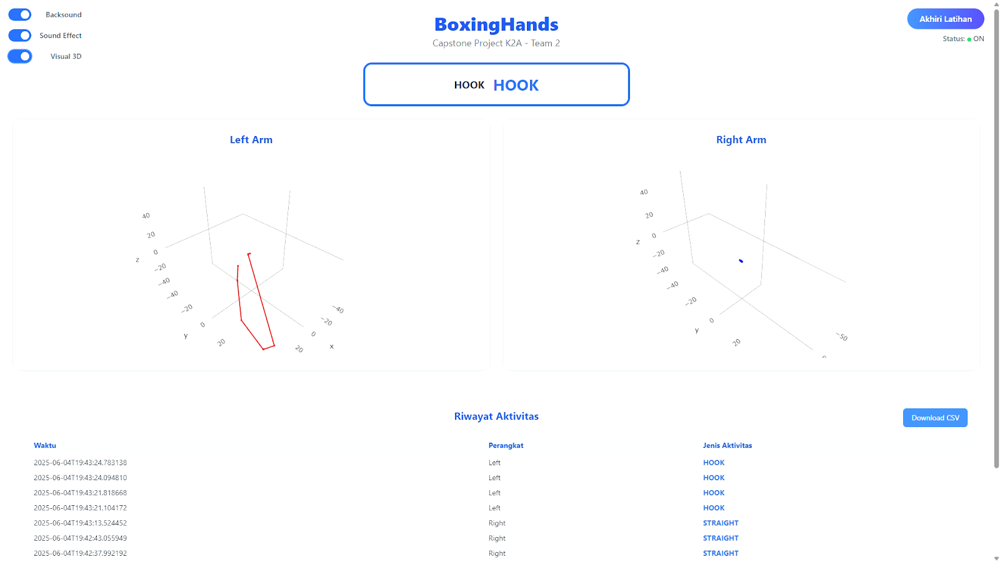
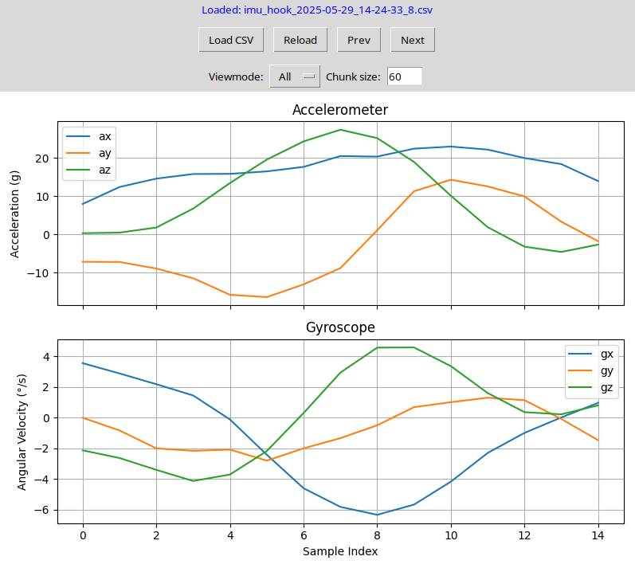
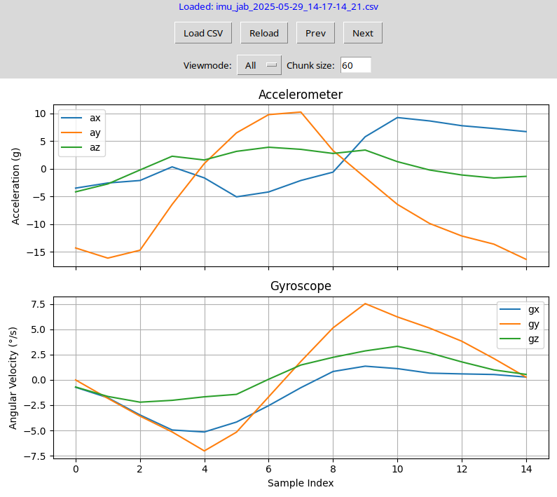
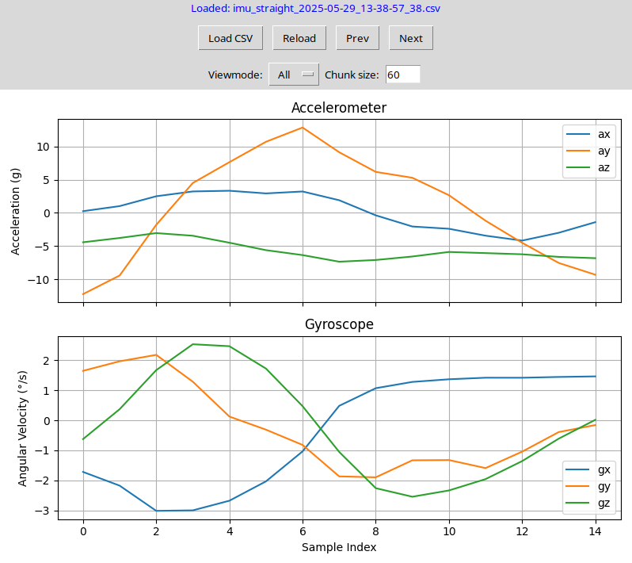
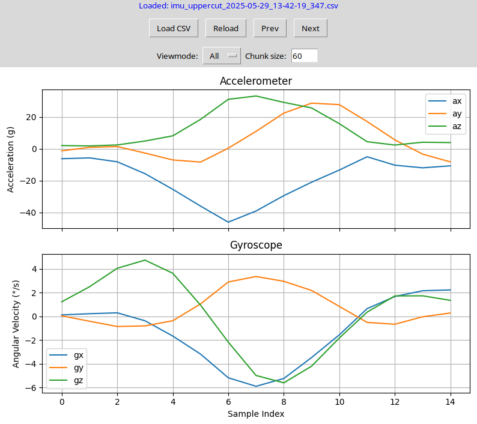

# 🥊 BoxingHands - A Boxing Classifier Wearable

An AI-powered wearable system that classifies boxing punches in real time using sensor data, deep learning, and a responsive web dashboard. Built by a passionate multidisciplinary team to push the boundaries of smart fitness technology.

---

## 📸 Demo
https://github.com/user-attachments/assets/04144166-a8ab-4c96-aef9-0380047c5dc8

---

## 📦 Features

- 🔁 **Real-time punch classification** using IMU (accelerometer & gyroscope) data via MQTT
- 💾 **Training data logging** to CSV files for future model training
- 🧠 **1D CNN model** deployed with TensorFlow Lite for Microcontrollers (TFLM) on ESP32
   
- 📈 **Web dashboard** with Tailwind, Chart.js, and Plotly:
  - 2D sensor data graphs (accelerometer and gyroscope)
  
  - 3D visualization toggle
  
  - Sound effect toggle
  - Punch history stored locally with SQLite
- 🔧 **Multi-sensor** (left & right hand) support
- 🛠️ **Modular backend** built with Flask

---

## 🎯 Current Limitations

> *Our team is actively working to improve these areas:*

1. ❌ No punch *form evaluation* (only classification)
2. 📐 Wearable design needs better *ergonomics*
3. 📉 3D visualization is not fully accurate
4. 🌙 Dark mode is not implemented on the web dashboard
5. 🔁 CNN is used instead of LSTM, which may be suboptimal for sequential pattern recognition

---

## 🧠 How It Works

1. **Data Collection**  
   ESP32-based wearable captures IMU data from the boxer's hands (left & right). Data is streamed using **MQTT** to a Python backend.

2. **Data Logging and Labeling**  
   The system can enter a **Recording Mode** to save IMU data as CSV files, which are later used to train the punch classification model.

   Below are sample IMU data visualizations for each punch type:

   ### 🥊 Hook  
   

   ### 🥊 Jab  
   

   ### 🥊 Straight  
   

   ### 🥊 Uppercut  
   

   > 💡 **Note:** The visualizations above were generated using `util/imu_visualizer.py`.

3. **Model**  
   A 1D CNN model is trained on labeled punch sequences, converted to **TFLM** format, and deployed to the ESP32.

4. **Real-Time Inference**  
   On-device inference classifies incoming punch sequences in real time. Detected punches are sent to the Flask backend.

5. **Dashboard Visualization**  
   - Users can view 2D sensor plots (Chart.js)
   - Toggle between 2D and 3D visualization (Plotly)
   - Toggle sound effects (punch "smacks", etc.)
   - SQLite logs each punch with timestamps and type

---

## 🚀 Getting Started

### 📋 Prerequisites

- ESP32 board with MPU6050 or equivalent IMU
- Python 3.8+
- MQTT broker (e.g., Mosquitto)
- Node.js (for dashboard tweaks)
- TFLM toolchain (TensorFlow Lite Micro)
- [PlatformIO](https://platformio.org/) for ESP32 firmware

### 🛠️ Installation

```bash
# Clone the repo
git clone https://github.com/yudhisthereal/BoxingHands.git
cd BoxingHands

# Backend dependencies
cd web-dashboard
pip install -r requirements.txt

# Start Flask server
python app.py

# Frontend (optional tweaks)
cd static
# Make changes and serve statically if needed
```

...

## 👥 Team Members

| Name                | Role                             |
|---------------------|----------------------------------|
| **Yudhistira**       | Embedded AI Programmer & Lead   |
| **Shadam J'Verron** | Backend Developer                |
| **Rafi A. Zulfikar**| Frontend Developer               |
| **Fahmi Robbani**   | ML Engineer & Video Editor       |
| **Rif'at Fadlillah**| Electrical & Mechanical Engineer |

---

## 👨‍💻 Contributors

We thank everyone who helped shape this project!

- [@Yudhistira](https://github.com/yudhisthereal) – system architecture, embedded AI, firmware, TFLM integration
- [@shadamjverron](https://github.com/shadamjv) – MQTT backend, Flask API, SQLite punch history
- [@rafialutfi](https://github.com/Rafialutfiz) – dashboard UI, Tailwind + Chart.js/Plotly integration
- [@fahmirobbani]() – model training, evaluation, video editing
- [@rifatfadlillah]() – hardware design, sensor wiring, ESP32 integration

> Want to contribute? [Open an issue](https://github.com/yudhisthereal/BoxingHands/issues) or fork the project!

...
